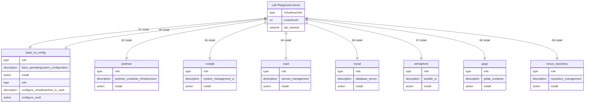

# Lab Playground Server design

***

```mermaid
erDiagram

"Lab Playground server" {
  type virtualmachine
  os rockylinux9
  network lab_network
}
"Lab Playground server" ||--|| "base_os_config" : "01. install"
"base_os_config" {
  type role
  description base_operatingsystem_configuration
  action install
}
"Lab Playground server" ||--|| "podman" : "02. install"
"podman" {
  type role
  description podman_container_infrastructure
  action install
}

"Lab Playground server" ||--|| "cockpit" : "03. install"
"cockpit" {
  type role
  description system_management_ui
  action install
}
"Lab Playground server" ||--|| "vault" : "04. install"
"vault" {
  type role
  description secrets_management    
  action install
}
"Lab Playground server" ||--|| "base_os_config" : "05. install"
"base_os_config" {
  type role
  description configure_virtualmachine_in_vault
  action configure_vault
}
"Lab Playground server" ||--|| "mysql" : "06. install"
"mysql" {
  type role
  description database_server
  action install
}
"Lab Playground server" ||--|| "semaphore" : "07. install"
"semaphore" {
  type role
  description ansible_ui
  action install
}
"Lab Playground server" ||--|| "gogs" : "08. install"
"gogs" {
  type role
  description gitlab_container    
  action install
}
"Lab Playground server" ||--|| "nexus_repository" : "09. install"
"nexus_repository" {
  type role
  description repository_management  
  action install
}
```
***

