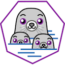

# RedHat Podman

***


Ansible role voor installatie en configuratie van podman.<br/>
<br/>
Website leverancier : `https://podman.io`<br/>
<br/>
<br/>


***

# Diensten:


action: **install**<br/>
Installatie van laatste versie van RedHat Podman. Basis configuratie.<br/>
variables:<br/>
<kbd>(geen)</kbd> : Geen variablen benodigd.<br/>


action: **uninstall**<br/>
De-installatie van RedHat Podman.<br/>
variables:<br/>
<kbd>(geen)</kbd> : Geen variablen benodigd.<br/>


action: **update**<br/>
Update van RedHat Podman.<br/>
variables:<br/>
<kbd>(geen)</kbd> : Geen variablen benodigd.<br/>


***


## Voorbereidingen
(geen).<br/>


## Afhankelijkheden
(geen).<br/>


## Installatie en configuratie
Installatie via action 'install'.<br/>
Voorbeeld voor installatie RedHat Podman:

```
---

- hosts: lab_server
  vars:
  roles:
    - role: podman
      vars:
        action : install

```


## Overige informatie
(geen).<br/>


## Licentie
MIT


## Auteur
Marcel Venema
